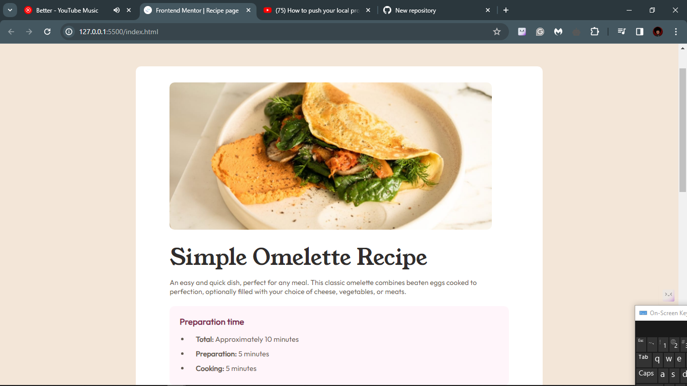

# Frontend Mentor - Recipe page solution

This is a solution to the [Recipe page challenge on Frontend Mentor](https://www.frontendmentor.io/challenges/recipe-page-KiTsR8QQKm). Frontend Mentor challenges help you improve your coding skills by building realistic projects. 

## Table of contents

- [Overview](#overview)
  - [The challenge](#the-challenge)
  - [Screenshot](#screenshot)
  - [Links](#links)
- [My process](#my-process)
  - [Built with](#built-with)
  - [What I learned](#what-i-learned)
  - [Continued development](#continued-development)
  - [Useful resources](#useful-resources)
- [Author](#author)
- [Acknowledgments](#acknowledgments)


## Overview

### Screenshot




### Links

- Solution URL: [Github](https://github.com/des254/recipe-page)
- Live Site URL: [Github Pages](https://des254.github.io/recipe-page/)

## My process

### Built with

- Semantic HTML5 markup
- CSS custom properties
- Mobile-first workflow
- [Styled Components](style-guide.md) - For styles

### What I learned
- Styling a <hr> tag with color.

```css
.hr {
    border-color: hsl(30, 18%, 87%);
    border-style: solid;
    margin: 10% 0;
}
```

### Continued development

- Using CSS flexbox in my future projects.
- Media queries understanding.
- Use of frameworks.

### Useful resources

- [W3schools](https://www.w3schools.com/html/html_paragraphs.asp) - This helped me for making preformatted text so that the lines are maintained as they are in VScode.

- [W3schools](https://www.w3schools.com/howto/howto_google_fonts.asp) - This is an amazing article which helped me finally understand how to add google fonts. I'd recommend it to anyone still learning this concept.

- [stackoverflow](https://stackoverflow.com/questions/6382023/changing-the-color-of-an-hr-element) - This is an amazing article which helped me finally understand how to style a hr element with CSS.


## Author

- Website - [Desmond Maina](https://www.your-site.com)
- Frontend Mentor - [@des254](https://www.frontendmentor.io/profile/des254)
- Twitter - [@_realdes254](https://www.twitter.com/_realdes254)


## Acknowledgments

Thanks to Frontend Mentor for this great opportunity to sharpen our skills
